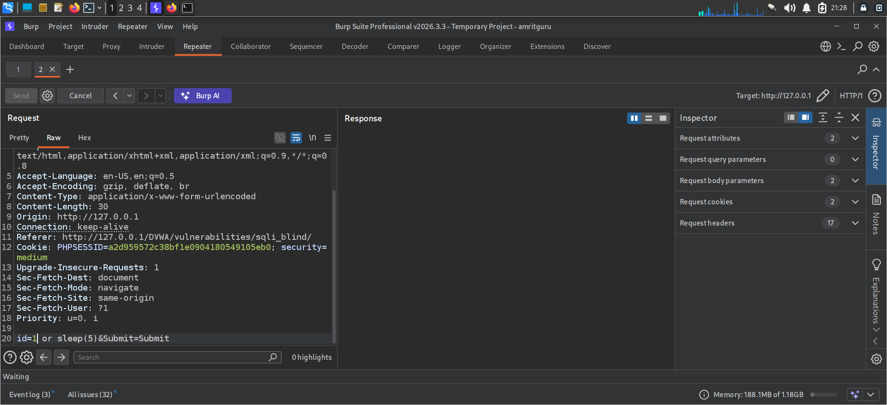
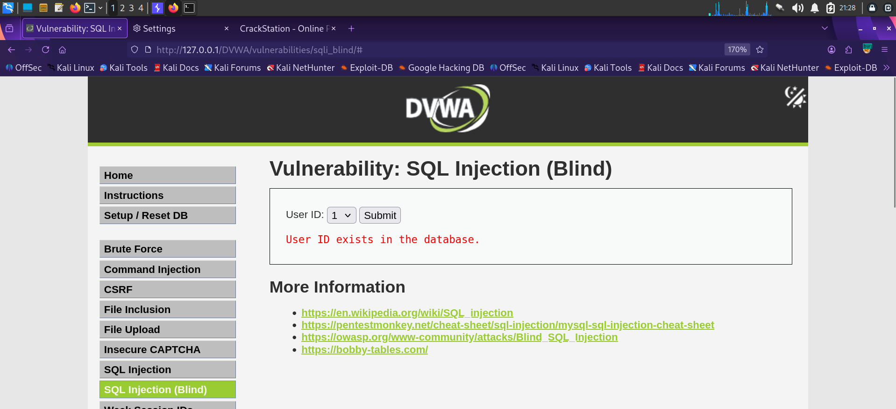

# Finding 2 — SQL Injection (Blind, Time-Based)

| | |
|---|---|
| **Severity** | 🟠 High |
| **OWASP Category** | [A03:2021 – Injection](../docs/OWASP_Top_10_2021.md#a032021--injection) |
| **CWE** | CWE-89: SQL Injection |
| **Location** | DVWA → SQL Injection (Blind) (Security Level: Medium) |
| **Parameter** | `id` (POST) |
| **Status** | ✅ Confirmed |

## Description

The Blind SQL Injection module returns no query output or visible error — only a generic "User ID exists / does not exist" message. Because the medium-security filter blocked simple quote-based payloads, injection was confirmed using a boolean check and validated with a MySQL time-delay function via Burp Repeater.

## Steps to Reproduce

1. Intercept the request in Burp Suite and send it to **Repeater**.
2. Submit a baseline payload: `id=1` and observe the response and timing.
3. Submit a time-based payload: `id=1 or sleep(5)` and measure the response delay.
4. A consistent ~5 second delay confirms the query executes attacker-controlled SQL even with no visible output.

## Payload Used

```
id=1 or sleep(5)&Submit=Submit
```

## Evidence

**1. Time-based payload in Burp Repeater** — `id=1 or sleep(5)`:



**2. Baseline response** — confirms normal application behavior ("User ID exists in the database") for `id=1`, establishing the control case against which the delayed response was compared:



## Impact

Blind SQL injection allows data exfiltration one bit/character at a time using conditional time delays, without any visible output. Given enough requests, entire tables (including credentials) can be reconstructed. This is slower than a classic UNION-based attack but equally dangerous and harder to detect via casual observation.

## Remediation

- Same root cause as Finding 1 — use parameterized queries everywhere, including POST-based endpoints.
- Implement rate limiting / request throttling to slow down automated blind-injection attempts.
- Monitor for abnormal response-time patterns as a detective control (WAF / IDS rule).

---
[← Back to findings summary](../README.md#-findings-summary)
