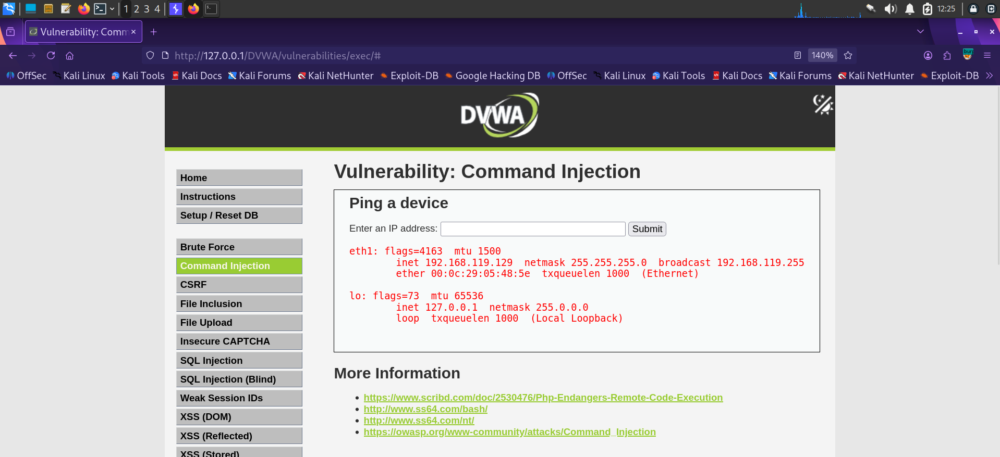

# Finding 3 — OS Command Injection

| | |
|---|---|
| **Severity** | 🔴 Critical |
| **OWASP Category** | [A03:2021 – Injection](../docs/OWASP_Top_10_2021.md#a032021--injection) |
| **CWE** | CWE-78: OS Command Injection |
| **Location** | DVWA → Command Injection (Security Level: Low) |
| **Parameter** | `ip` (POST) |
| **Status** | ✅ Confirmed |

## Description

The "Ping a device" feature passes user-supplied input directly to a system `ping` call without sanitizing shell metacharacters. Appending a second command using a shell operator causes both commands to execute, confirming arbitrary OS command execution in the context of the web server.

## Steps to Reproduce

1. Navigate to **DVWA → Command Injection**.
2. Submit a normal IP address to confirm expected behavior.
3. Submit a chained payload appending a second command, e.g. `127.0.0.1 && ifconfig`.
4. Observe that the output of the injected command is returned in the response.

## Payloads Used

```bash
127.0.0.1 && ifconfig
127.0.0.1; whoami
127.0.0.1 | cat /etc/passwd
```

## Evidence

**Injected `ifconfig` output** returned alongside the ping result, confirming OS command execution:



## Impact

Full remote command execution in the context of the web server user. Depending on server configuration, this can lead to reading sensitive files, planting web shells, pivoting to internal network segments, or full host compromise.

## Remediation

- Avoid shelling out to OS commands from application code wherever possible; use language-native networking libraries instead.
- If shell execution is unavoidable, use an allow-list of expected input (e.g. strict IPv4 regex) and pass arguments via safe APIs (e.g. `escapeshellarg()`) rather than string concatenation.
- Run the web server process with least-privilege permissions and apply OS-level sandboxing.

---
[← Back to findings summary](../README.md#-findings-summary)
