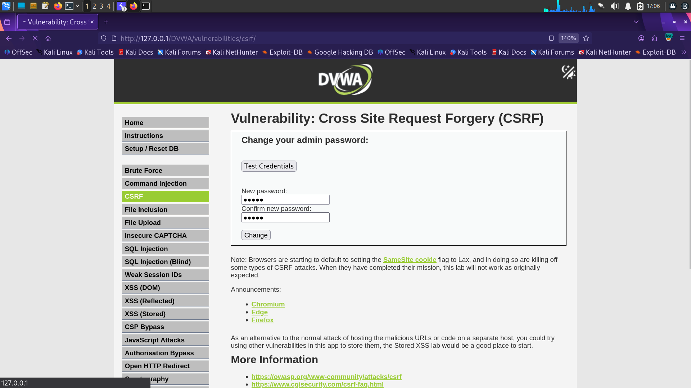
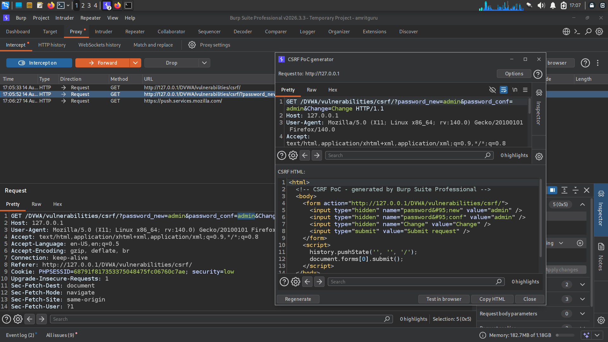
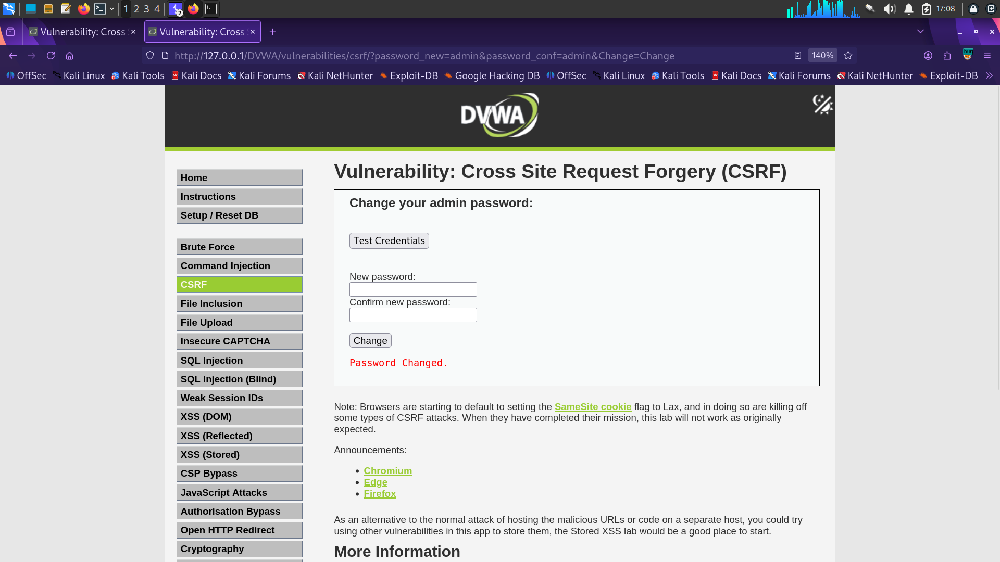

# Finding 4 — Cross-Site Request Forgery (CSRF)

| | |
|---|---|
| **Severity** | 🟠 High |
| **OWASP Category** | [A01:2021 – Broken Access Control](../docs/OWASP_Top_10_2021.md#a012021--broken-access-control) |
| **CWE** | CWE-352: Cross-Site Request Forgery |
| **Location** | DVWA → CSRF (Security Level: Low) |
| **Endpoint** | `/DVWA/vulnerabilities/csrf/` |
| **Status** | ✅ Confirmed |

## Description

The "change password" action accepts the new password via a simple GET request and performs the change without verifying a per-request, unpredictable CSRF token. This allows an attacker to forge a malicious page that, once visited by an authenticated victim, silently changes the victim's password.

## Steps to Reproduce

1. Log into DVWA and open the CSRF module.
2. Observe that submitting the password-change form issues a GET request with `password_new` and `password_conf` as plain query parameters.
3. Use Burp Suite's CSRF PoC generator to auto-build a self-submitting HTML form targeting the same endpoint.
4. Host/open the generated PoC while the victim session is authenticated; the password changes without further interaction.

## Evidence

**1. Password-change form** — no visible token protection:



**2. Burp Suite CSRF PoC generator** — auto-crafting a self-submitting exploit form from the captured request:



```html
<form action="http://127.0.0.1/DVWA/vulnerabilities/csrf/">
  <input type="hidden" name="password_new" value="admin" />
  <input type="hidden" name="password_conf" value="admin" />
  <input type="hidden" name="Change" value="Change" />
</form>
<script>document.forms[0].submit();</script>
```

**3. Exploit success** — "Password Changed" confirmation after the forged request executes without victim confirmation:



## Impact

An attacker can force a logged-in victim to unknowingly perform state-changing actions — in this case, taking over the account by resetting its password. In a real application, the same flaw could be used to transfer funds, change email addresses, or modify account permissions.

## Remediation

- Implement per-session, per-request anti-CSRF tokens validated server-side on every state-changing request.
- Require the password-change action to use POST, not GET, and re-authenticate the user (require current password).
- Set the session cookie's `SameSite` attribute to `Strict` or `Lax` to reduce cross-origin request delivery.

---
[← Back to findings summary](../README.md#-findings-summary)
