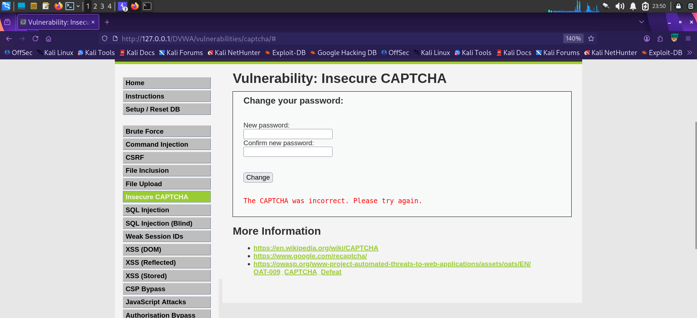
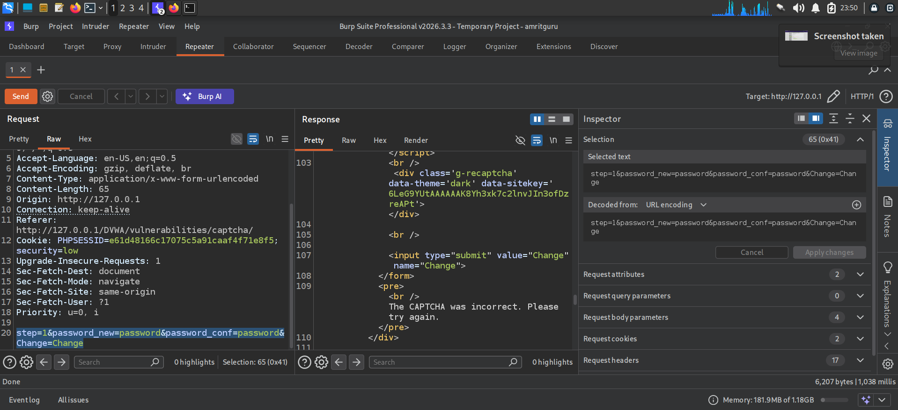

# Finding 5 — Insecure CAPTCHA Implementation

| | |
|---|---|
| **Severity** | 🟡 Medium |
| **OWASP Category** | [A07:2021 – Identification and Authentication Failures](../docs/OWASP_Top_10_2021.md#a072021--identification-and-authentication-failures) |
| **CWE** | CWE-804: Guessable CAPTCHA / Improper Server-Side Validation |
| **Location** | DVWA → Insecure CAPTCHA (Security Level: Low) |
| **Endpoint** | `/DVWA/vulnerabilities/captcha/` |
| **Status** | ✅ Confirmed |

## Description

The password-change workflow is intended to be gated by a Google reCAPTCHA step. However, the server processes the request in discrete steps (`step=1`, `step=2`) and does not verify that the CAPTCHA step actually succeeded before applying the password change. By replaying the request directly with `step=1` in Burp Repeater, the CAPTCHA can be bypassed entirely.

## Steps to Reproduce

1. Submit the password-change form with an intentionally wrong/blank CAPTCHA response to observe the standard failure message.
2. Intercept the underlying POST request in Burp Suite and send it to Repeater.
3. Modify the request body to include `step=1` directly alongside the new password fields, omitting the CAPTCHA response.
4. Replay the request — the server processes the password change despite no valid CAPTCHA being supplied.

## Payload Used

```
step=1&password_new=password&password_conf=password&Change=Change
```

## Evidence

**1. Standard failure message** — submitting without solving the CAPTCHA correctly:



**2. Burp Repeater bypass** — forcing `step=1` and omitting the CAPTCHA field entirely bypasses the intended control:



## Impact

The CAPTCHA control provides no real protection against automated password-change abuse, defeating its purpose of preventing scripted/bot-driven account changes and credential-stuffing-style automation.

## Remediation

- Validate the CAPTCHA response server-side on every request that performs the protected action, not just on a separate "step."
- Never trust a client-supplied `step` parameter to indicate a prior verification step succeeded — track verification state server-side (session).
- Fail closed: reject the action entirely if CAPTCHA verification cannot be confirmed for the current request.

---
[← Back to findings summary](../README.md#-findings-summary)
