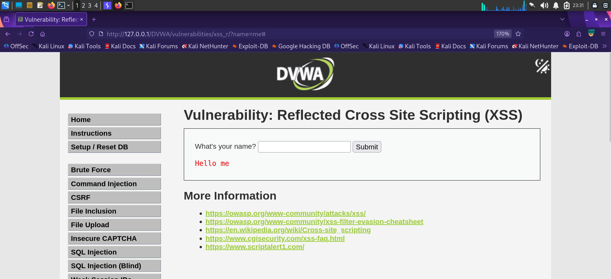

# Finding 6 — Reflected Cross-Site Scripting (XSS)

| | |
|---|---|
| **Severity** | 🟡 Medium |
| **OWASP Category** | [A03:2021 – Injection](../docs/OWASP_Top_10_2021.md#a032021--injection) |
| **CWE** | CWE-79: Improper Neutralization of Input During Web Page Generation |
| **Location** | DVWA → XSS (Reflected) (Security Level: Low) |
| **Parameter** | `name` (GET) |
| **Status** | ✅ Confirmed |

## Description

The "What's your name?" field reflects user input directly back into the HTML response without output encoding, allowing injection of arbitrary HTML/JavaScript that executes in the victim's browser.

## Steps to Reproduce

1. Navigate to **DVWA → XSS (Reflected)**.
2. Submit a benign value (e.g. `me`) to confirm the input is reflected verbatim in the page.
3. Submit a script payload, e.g. `<script>alert(document.cookie)</script>`, to confirm execution.

## Payloads Used

```
http://127.0.0.1/DVWA/vulnerabilities/xss_r/?name=me
<script>alert(document.cookie)</script>
```

## Evidence

**Unsanitized reflection** of the `name` parameter, confirming the injection point:



## Impact

Because the payload is reflected without encoding, an attacker can craft a malicious link that, when clicked by a victim, executes arbitrary JavaScript in their session — enabling session-cookie theft, credential phishing overlays, or drive-by redirection.

## Remediation

- HTML-encode all user-supplied output at the point of rendering (e.g. `htmlspecialchars()` in PHP).
- Implement a strict Content-Security-Policy (CSP) header to restrict inline script execution.
- Set the session cookie with `HttpOnly` to limit the impact of any successful XSS on cookie theft.

---
[← Back to findings summary](../README.md#-findings-summary)
