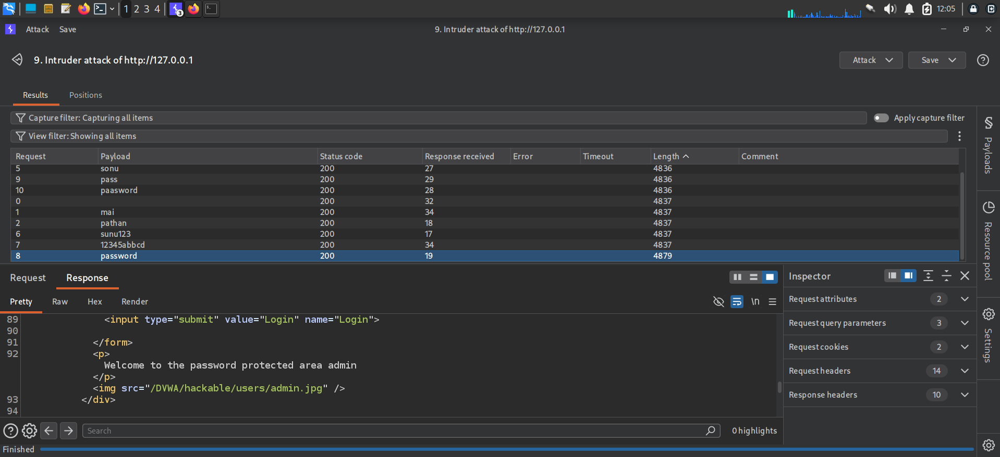

# Finding 7 — Weak Authentication / Brute-Forceable Login

| | |
|---|---|
| **Severity** | 🟠 High |
| **OWASP Category** | [A07:2021 – Identification and Authentication Failures](../docs/OWASP_Top_10_2021.md#a072021--identification-and-authentication-failures) |
| **CWE** | CWE-307: Improper Restriction of Excessive Authentication Attempts |
| **Location** | DVWA → Brute Force (Security Level: Low) |
| **Endpoint** | `/DVWA/login.php` |
| **Status** | ✅ Confirmed |

## Description

The login form does not implement account lockout, rate limiting, or CAPTCHA after repeated failed attempts, allowing an attacker to enumerate valid credentials via automated password guessing.

## Steps to Reproduce

1. Capture a login request in Burp Suite and send it to Intruder.
2. Configure the password parameter as the attack position and load a candidate password wordlist.
3. Run the attack and identify the successful attempt by response length/status differences.
4. Confirm the valid credential by inspecting the response content (e.g. a distinct "Welcome to the password protected area" message).

## Evidence

**Burp Intruder results** — the candidate password `password` returns a distinct response length (4879 vs. 4836/4837 for others), revealing the successful login:



> This is functionally equivalent to a dictionary attack that could also be performed with **Hydra** against SSH or the same web login form — reference syntax reviewed in [`screenshots/00-environment/hydra-reference-docs.png`](../screenshots/00-environment/hydra-reference-docs.png):
> ```bash
> hydra -l <username> -P <full path to pass> MACHINE_IP -t 4 ssh
> ```

## Impact

Combined with predictable or default credentials, an unthrottled login form allows attackers to brute-force valid accounts, including administrative accounts, leading to full account or application compromise.

## Remediation

- Implement account lockout or exponential back-off after a small number of failed attempts.
- Add CAPTCHA or multi-factor authentication for login, not just for the password-change flow.
- Enforce a strong password policy and check new passwords against known-breached password lists.
- Log and alert on repeated failed login attempts from a single source.

---
[← Back to findings summary](../README.md#-findings-summary)
